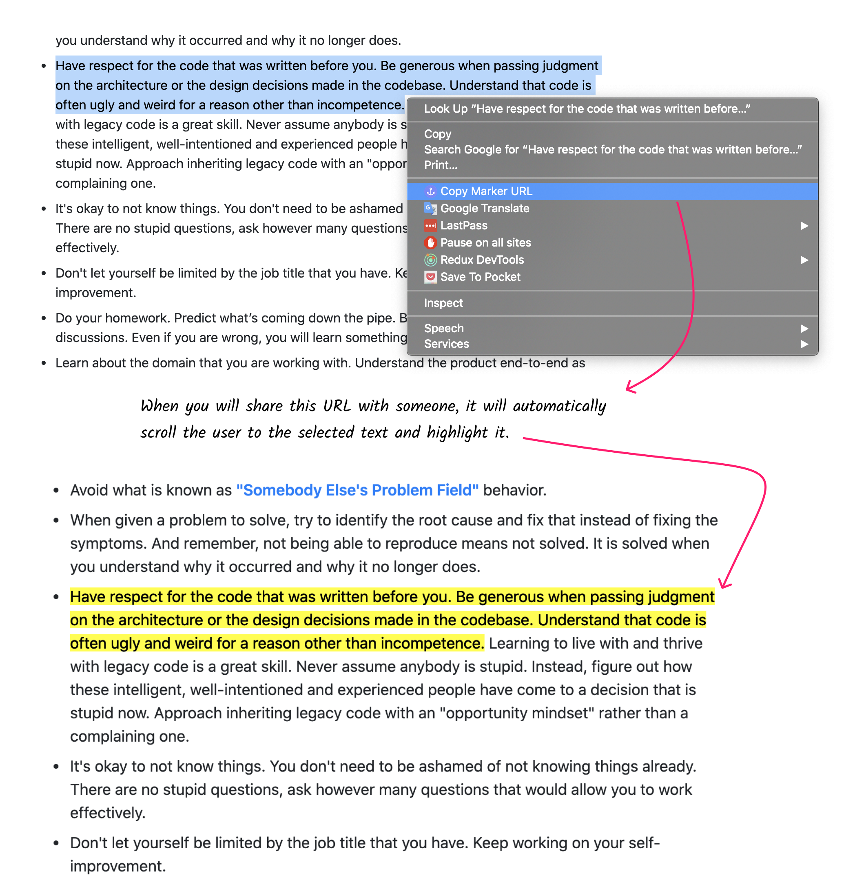

# Copy Marker
> Chrome extension — Create URLs with highlighted page selection.

Copy Marker allows you to select some text on page, right click and "Copy Marker URL" which will copy the URL with your selection information embedded in the URL. You can share it with someone and when they open that URL it will automatically highlight the selection you made and scroll the user to that section of the page.

## Install 

Install it from the [Chrome Web Store]() or download and [install manually](http://superuser.com/a/247654/6877)

## Inspiration

You might have noticed that Google recently started [highlighting the content](https://i.imgur.com/YVcpRjb.png) of the target page when you land it from the Google's search results. It uses [Text Fragments](https://wicg.github.io/scroll-to-text-fragment/) to achieve that. Copy Marker is a chrome extension that let's you simulate the same behavior.

## Contributions

Feel free to submit pull requests, create issues or spread the word.

## License

MIT © [Kamran Ahmed](https://twitter.com/kamranahmedse)
